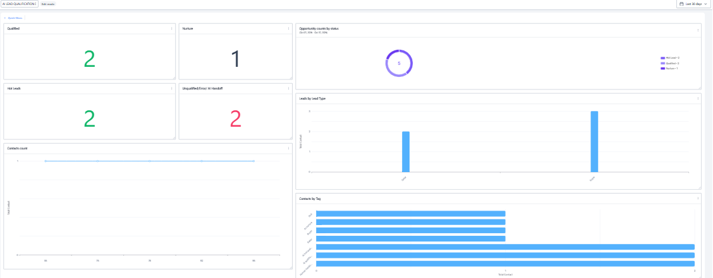

# AI Real Estate Lead Qualification System

An AI-powered lead qualification workflow designed to help real estate teams automatically engage new leads, collect key qualification information, organize lead data, and route opportunities for the appropriate next step.

## Overview

Real estate teams often receive leads from multiple sources, but manually qualifying each lead can be time-consuming and inconsistent.

This project demonstrates a CRM-based AI qualification system that helps automate the early stages of the sales process while keeping human agents involved when their attention is needed.

The system is designed to:

* Start an AI conversation with new leads
* Collect relevant buyer or seller information
* Structure and store qualification data
* Determine lead qualification status
* Route qualified leads into the appropriate pipeline stage
* Identify leads requiring human attention
* Handle qualification errors and handoffs
* Provide visibility through a CRM dashboard

## High-Level Workflow

```text
New Lead
   ↓
AI Conversation
   ↓
Lead Qualification
   ↓
AI Data Extraction
   ↓
CRM Data Update
   ↓
Lead Classification
   ↓
Opportunity Routing
   ↓
Human Handoff When Needed
   ↓
CRM Dashboard
```

## Key Capabilities

### AI Lead Qualification

The AI engages new leads conversationally and gathers the information required by the sales team.

### Structured Data Capture

Important qualification information is converted into structured CRM data instead of remaining only inside the conversation.

### Intelligent Lead Routing

Leads are categorized according to their qualification outcome and routed to the appropriate stage of the sales pipeline.

### Human Handoff

The system recognizes situations that require human involvement and flags those leads for follow-up.

### Error Handling

The workflow includes handling for qualification failures so that leads do not silently fall through the process.

### Pipeline Visibility

A CRM dashboard provides visibility into qualified leads, hot leads, handoff requirements, errors, and overall opportunity activity.

## Technology

* GoHighLevel
* Conversation AI
* CRM Workflows
* Custom Contact Fields
* Opportunity Pipeline
* AI-assisted data extraction
* Automated notifications
* CRM Dashboard

## Project Architecture

The complete implementation is intentionally not published. This repository presents the system architecture and project outcome while keeping the underlying workflow configuration private.

The implementation includes proprietary workflow logic, AI instructions, qualification rules, field mappings, and CRM configuration that are not included in this repository.

## Screenshots

### System Architecture


### AI Conversation


### Opportunity Pipeline


### CRM Dashboard



## Example Lead Data

A sanitized example of the type of structured information produced by the system is available in:

`examples/sample-lead.json`

No real customer information or private CRM data is included.

## Business Value

This system is designed to help real estate teams:

* Reduce manual lead qualification
* Respond to new leads faster
* Keep qualification data organized
* Prioritize high-value opportunities
* Reduce missed follow-ups
* Escalate leads that require human attention
* Improve visibility across the sales pipeline

## My Role

**AI Automation Specialist & Workflow Designer**

I designed and implemented the overall lead qualification workflow, including the AI conversation experience, CRM data structure, lead routing logic, human handoff process, error handling, and reporting layer.

The project demonstrates my ability to translate a business requirement into a practical AI-powered automation system.

## Portfolio Note

This repository intentionally focuses on **architecture, functionality, and business outcomes rather than exposing the complete implementation**.

Detailed AI prompts, workflow configurations, scoring logic, field mappings, and internal automation rules are kept private.
